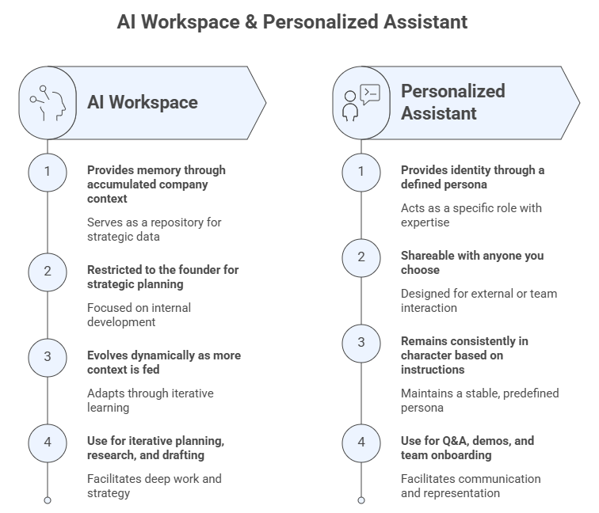

# Welcome to AI Cofounder

Welcome to **AI Cofounder**, part of the **FGCU AI Academy** led by the **Dendritic Institute
for Human-Centered AI & Data Science** at Florida Gulf Coast University.

**AI Cofounder** is the *applied entrepreneurship offering* of the **FGCU AI Academy**,
designed for anyone who wants to build, plan, or grow a company in the age of artificial
intelligence. Whether you are an aspiring entrepreneur with an idea, a professional exploring a
new venture, or a business owner looking to reinvent your strategy, this program gives you the
mindset, tools, and frameworks to move from concept to plan, with AI as your strategic partner
at every step.

This program is not about coding, machine learning, or building software. It is about learning
to *think and plan like a founder*, and doing that thinking and planning *with AI as your
cofounder*. By the end of this journey, you will have produced an **AI Company Blueprint**: a
structured, AI-assisted planning artifact that covers your strategy, your customers, your
business model, and your pitch.

This Jupyter Book is your **interactive guide** through the company-building process, from
entrepreneurial mindset and opportunity discovery to business modeling and investor pitching,
with AI tools woven into every stage.

## 1. Program Goals

The goal of this program is to equip learners with the entrepreneurial frameworks and
AI-augmented skills to confidently plan, design, and communicate a new company or venture.
By the end of this journey, you will:

- Understand how AI is transforming entrepreneurship and what it means to build a company
  with AI as a strategic partner (a cofounder).
- Use GenAI tools effectively for business research, strategic planning, and decision-making.
- Apply foundational entrepreneurial frameworks, such as strategic positioning, customer development,
  and business model design, augmented by AI at each stage.
- Build and use an **AI Cofounder Workspace**: a sharable, persistent and context-rich AI environment
  that evolves alongside your company concept across all four sessions.
- Build and use an **AI Assistant** to serve as the engine of a chatbot for your company. 
- Develop and communicate a compelling business case through an AI-assisted pitch.

## 2. Learning Objectives

By completing this program, you will be able to:

- Describe how AI is reshaping entrepreneurship and identify AI-enhanced entrepreneurial
  competencies.
- Set up and use an AI Workspace (Project) as a strategic co-thinking partner for business
  planning.
- Craft effective prompts and contexts for entrepreneurial use cases, including research, analysis,
  strategy, and communication.
- Define your startup's mission, vision, value proposition, and competitive position using
  AI-assisted frameworks.
- Use AI to build customer personas, simulate discovery interviews, and design
  empathy-driven solutions.
- Complete a Business Model Canvas for a new company or venture with AI assistance.
- Design and deliver an elevator pitch and pitch deck draft, enhanced by AI tools.
- Critically evaluate AI outputs and maintain human judgment throughout the planning process.

## 3. Learning Philosophy and Approach

This program embraces a **human-centered, practice-first philosophy**. The entrepreneurial
process is inherently iterative, ambiguous, and human. AI does not replace that; it amplifies
it.

Key principles guiding this program:

- **AI augments judgment, it does not replace it.**
  Every framework, tool, and activity in this program is designed to develop *your* thinking.
  AI is the accelerator, not the author.

- **Build while you learn.**
  Each module produces a concrete piece of your AI Company Blueprint. By Module 4, you
  leave with a real artifact, not just notes.

- **Iteration over perfection.**
  Company plans evolve. Treat every AI output as a starting point to critique, refine, and
  improve, not as a finished answer.

- **The best prompt is a well-framed question/ask.**
  Entrepreneurship and prompt engineering share a core skill: asking the right question in the
  right context. This program develops both simultaneously.

## 4. The AI Workspace: Your Cofounder's Design Environment 

One of the most powerful, and underused, features of modern GenAI platforms is the ability
to create a **persistent AI Workspace**: a dedicated environment where your AI assistant
retains context about your company, your goals, and your decisions across multiple
conversations.

**Think of it this way:** <p>
> A human cofounder has the whole context, he/she remembers your previous conversations, knows your
company's mission, understands your target customer, and builds on what you discussed last
week. An AI Workspace does exactly that, it gives your AI cofounder *memory and knowledge*.

In this program, you will set up your **AI Cofounder Workspace** at the beginning of Module 1,
and you will use it across all modules. As you complete each Blueprint piece, you will
feed that context back into your Workspace. So, by Module 4, your AI cofounder knows your
mission, your customer, your business model, and your competitive landscape, and can help you
build a pitch grounded in everything you have developed together.

### Setting Up Your AI Cofounder Workspace

Different GenAI platforms offer equivalent workspace features under different names:

| Platform | Workspace Feature | How to Access |
|---|---|---|
| **Claude** (Anthropic) | Projects | claude.ai → New Project |
| **ChatGPT** (OpenAI) | Projects | chatgpt.com → Projects |
| **Perplexity** | Spaces | perplexity.com → Spaces |
| **Grok** (X.ai) | Projects | x.ai → Projects |
| **Copilot** (Microsoft) | Projects | copilot.microsoft.com → Projects |

Regardless of platform, the setup follows the same logic:

1. **Create a new Workspace** named after your company concept
   (e.g., *"GreenTrace Startup"* or *"MedAssist Ventures"*).
2. **Write a Workspace System Prompt**, that is, a short paragraph that introduces your company
   idea, your role, and what you want the AI to help with. You will draft this in Module 1.
3. **Feed each Blueprint piece** into the Workspace as you complete it, so the AI
   accumulates context progressively across the four sessions.
4. **Run all program activities inside this Workspace**, not in a generic chat window.
   Start one specific chat (thread) for each blueprint piece and rename it accordingly.
   This is what organizes the environment and makes the AI a genuine cofounder rather than a one-off assistant.

**Why this matters:** 
> A generic AI chat has no memory of your company and retains no context. Your AI Cofounder
Workspace does. The difference between a useful AI tool and a genuine strategic partner
is *context*, and you are going to build that context deliberately, piece by piece.

## 5. The Personalized Assistant: Your AI Cofounder's Identity

A Personalized Assistant is a pre-configured AI chatbot that you design, instruct, and
deploy for a specific purpose. Unlike a generic AI chat, it:

- Has a **defined name and persona** (e.g., *"Nova — AI Strategy Advisor for GreenTrace"*)
- Operates under **specific instructions** that keep it focused on your startup's domain,
  tone, and goals
- Can be loaded with **company knowledge**, your Blueprint pieces, your product
  documentation, your FAQs, as an embedded knowledge base
- Can be **shared with others**, such as team members, customers, advisors, or investors
  exploring your concept
- Maintains **consistent behavior** every time it is accessed. It does not drift or forget
  its role the way a generic chat might

### Setting Up Your Personalized Assistant

Different platforms use different terminology, but the setup logic is consistent:

| Platform | Feature | How to Create | Key Capability |
|---|---|---|---|
| **ChatGPT** (OpenAI) | Custom GPTs | chatgpt.com → Explore GPTs → Create | Conversational builder, web browsing, image generation, Actions (API calls) |
| **Gemini** (Google) | Gems | gemini.google.com → Gems → Create a Gem | Custom instructions, Google Workspace integration |
| **Copilot** (Microsoft) | Copilot Studio Agents | copilotstudio.microsoft.com | Enterprise integration, Teams deployment |

Regardless of platform, every Personalized Assistant requires three core configuration
elements:

1. **Name and persona**: Give your assistant a name and a brief description of its role.
   This anchors its identity for every user who interacts with it.

2. **System instructions**: A structured set of guidelines that tell the assistant *who it
   is, what it knows, how it should behave, and what it should not do*. This is the most
   important configuration element. You will write this in Module 1.

3. **Knowledge base**: Documents, FAQs, or text that the assistant can draw on when
   answering questions. You will populate this progressively with your Blueprint pieces.

**Why this matters:** <p>
> Your Personalized Assistant is only as good as its instructions and knowledge base. Spend time
refining the system prompt, because it is an important writing you will do in this program.
A well-written assistant set of instructions and knowledge base will improve every conversation anyone has with your
startup's AI cofounder.

## 6. AI Workspace vs Personalized Assistant

While the AI Workspace gives your AI cofounder *context and memory*, a **Personalized Assistant** gives
it *identity and support*, a defined name, role, persona, expertise, and set of capabilities configured
specifically for your startup. Think of the two as complementary layers of the same
relationship:

| | AI Workspace (Project) | Personalized Assistant |
|---|---|---|
| **What it provides** | Memory: accumulated context about your company | Identity: a defined persona and role |
| **Who uses it** | You, as the founder doing strategic planning | You + anyone you choose to share it with |
| **How it behaves** | Evolves as you feed it more context | Consistently "in character" based on its instructions |
| **Best used for** | Iterative planning, research, document drafting | Q&A, demos, customer simulation, team onboarding |
| **Platform examples** | Claude Projects, ChatGPT Projects | Custom GPTs, Gemini Gems |

Together, the Workspace and the Personalized Assistant form your **AI Cofounder setup**: 
a private planning environment where strategy is developed, and a deployable AI
representative that embodies your startup for any audience.

### How the Two Tools Work Together

In this program, you will configure your Personalized Assistant in Module 1 and use it
progressively throughout the four modules, loading it with each Blueprint piece as you
complete it, just as you do with the Workspace. By Module 4, your Personalized Assistant
will be a fully briefed AI representative of your startup, capable of:

- Answering questions about your company's mission, product, and value proposition
- Simulating investor Q&A for pitch practice
- Onboarding new team members or collaborators
- Serving as a demo artifact that showcases how your startup uses AI



## 7. The Role of Generative AI in This Program

In AI Cofounder, GenAI tools serve as **strategic thinking partners**, not ghostwriters, not
answer machines. Throughout this program, AI assists with:

- **Research and analysis**: market sizing, competitor mapping, trend identification.
- **Strategic questioning**: challenging assumptions, surfacing blind spots, stress-testing ideas.
- **Customer simulation**: generating and role-playing customer personas, simulating discovery
  interviews.
- **Business modeling**: exploring revenue models, cost structures, and growth scenarios.
- **Communication**: drafting pitch narratives, refining messaging, preparing for Q&A.

However, AI does not replace:

- **Domain judgment**: knowing your industry, your customers, and your context.
- **Ethical reasoning**: deciding what kind of company to build, and how.
- **Human relationships**: customer trust, team culture, investor relationships.
- **Critical evaluation**: recognizing when an AI output is wrong, shallow, or misleading.

In every activity in this program, *you* are the decision-maker. The AI is your research
partner, devil's advocate, and drafting assistant, but the company is yours.

## 8. How to Use This Book

- Navigate sessions using the left-hand sidebar or the **Next / Previous** buttons at the
  bottom of each page.
- Each session opens with a **framing block** (concepts and frameworks), moves into
  **AI-assisted activities**, and closes with a **Blueprint Checkpoint**, your session
  deliverable.
- Look for **💡 Examples**, **⚙️ Classwork Activities (CW)**, and **📋 Blueprint Checkpoints**
  throughout.
- Prompts marked with **Reference Prompt** are ready to copy, paste into your
  AI Cofounder Workspace, and adapt to your concept.
- Use this book alongside the live sessions, Canvas course materials, and AI demonstrations
  offered by the **FGCU AI Academy**.

## 9. Your AI Company Blueprint

The **AI Company Blueprint** is the cumulative deliverable of this program: a structured,
AI-assisted planning artifact you build progressively across all four modules.

| Module | Blueprint Piece | What It Contains |
|---|---|---|
| **1** | Strategic Positioning Statement | Mission, vision, core values, problem description, unique value proposition, SWOT analysis |
| **2** | Customer Persona + Value Proposition | Target customer profile, customer pains and gains, value map, jobs-to-be-done |
| **3** | Business Model Canvas | All 9 BMC blocks, unit economics basics, key assumptions |
| **4** | Elevator Pitch + Pitch Deck Draft | 180-second pitch script, 10-slide deck outline |

The Blueprint is not a finished business plan, it is a **living document** designed to be
refined, tested, and evolved as you move from planning to building. At the end of Module 4,
you will assemble all four pieces into a single cohesive artifact.

## 10. Program Roadmap at a Glance

| Session | Theme | Core Focus |
|---|---|---|
| **1** | *The AI Cofounder Mindset* | AI entrepreneurship revolution · AI-enhanced competencies · GenAI toolkit for founders · Strategic positioning |
| **2** | *Customer & Idea Discovery with AI* | Customer development · Design thinking · Empathy mapping · Value proposition design |
| **3** | *Business Model & Planning with AI* | Lean startup · Business Model Canvas · Legal essentials · Funding landscape |
| **4** | *From Plan to Pitch with AI* | Pitch deck design · Entrepreneurial storytelling · AI-enhanced delivery · Blueprint assembly |

## Reflection

As you begin this program, consider the following questions:

- What problem do you most want to solve and who would benefit most if you solved it?
- How might AI change what is possible for you as an entrepreneur, compared to five years ago?
- What does it mean to *work with* an AI rather than simply *use* one?
- What will human founders need to be uniquely good at in a world where AI handles much of
  the analytical and drafting work?

Revisit these questions at the end of Module 4. Your answers will have changed.

## About the Instructor – Dr. Leandro Nunes de Castro

- Professor in the **Department of Computing and Software Engineering**,
  U.A. Whitaker College of Engineering, FGCU.
- Ph.D. in Computer Engineering with 30 years of experience in **Artificial Intelligence,
  Data Science, and Natural Computing**.
- Founding Director of the **Dendritic Institute for Artificial Intelligence and Data Science** at FGCU.
- Author of various AI and Data Science books and papers, and recognized among the
  **Top 2% most influential researchers in Computer Science worldwide**.
- Experienced entrepreneur, researcher, and educator with a focus on applying AI for
  innovation, business, and societal impact.
- Active mentor and collaborator with international academic and industry partners.

## 🧾 Acknowledgements

Developed by **Dr. Leandro Nunes de Castro**©️ for the **Dendritic Institute for
Human-Centered AI & Data Science**, within the **U.A. Whitaker College of Engineering at
Florida Gulf Coast University**.

Content curated with support from large language models such as ChatGPT, Claude, Gemini,
Perplexity, Gamma.ai, Napkin, and CoPilot, following ethical and pedagogical review.

```{note}
*This Jupyter Book is part of the FGCU AI Academy's Applied Entrepreneurship Track, aligning
with the Dendritic Institute's mission to foster responsible, innovative, and human-centered
engagement with artificial intelligence.*
```
